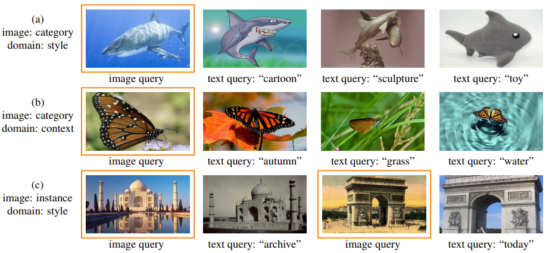
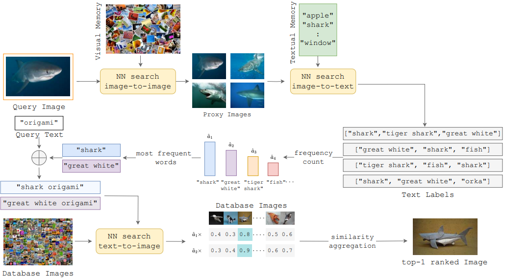

# Composed Image Retrieval for Training-FREE DOMain Conversion (WACV 2025)

This repository contains the PyTorch implementation of our WACV 2025 paper: **"Composed Image Retrieval for Training-FREE DOMain Conversion".** [[ArXiv](https://arxiv.org/abs/2412.03297)]

<div align="center">
  
</div>

## Overview
We introduce FREEDOM, a training-free, composed image retrieval method for domain conversion based on CLIP. Given an image query and a text query that names a domain, images are retrieved having the class of the image query and the domain of the text query. A range of applications is targeted, where classes can be defined at the category or instance level, and domains can be defined as styles or contexts.

### Motivation
In this paper, we focus on a specific variant of composed image retrieval, namely domain conversion, where the text query defines the target domain. Unlike conventional
cross-domain retrieval, where models are trained to use queries of a source domain and retrieve items from another target domain, we address a more practical, open-domain setting, where the query and database may be from any unseen domain. We target different variants of this task, where the class of the query object is defined at category-level or instance-level. At the same time, the domain corresponds to descriptions of style or context. Even though domain conversion is a subset of the tasks handled by existing CIR methods, the variants considered in our work reflect a more comprehensive set of applications than what was encountered in prior art.

### Approach

Given a query image and a query text indicating the target domain, proxy images are first retrieved from the query through an image-to-image search over a visual memory. Then, a set of text labels is associated with each proxy image through an image-to-text search over a textual memory. Each of the most frequent text labels is combined with the query text in the text space, and images are retrieved from the database by text-to-image search. The resulting sets of similarities are linearly combined with the frequencies of occurrence as weights.

<div align="center">
  
</div>

## Environment
Our experiments were conducted using **python 3.10**. To set up the environment, run:
```
python -m venv ~/freedom
source ~/freedom/bin/activate
pip install -r requirements.txt
```
## Dataset
### Downloading the datasets
1) Download the [**ImageNet-R**](https://people.eecs.berkeley.edu/\~hendrycks/imagenet-r.tar) dataset and the validation set of [**ILSVRC2012**](https://image-net.org/data/ILSVRC/2012/ILSVRC2012_img_val.tar) and place them in the directory `data/imagenet-r`.
2) Download the [**LTLL**](https://users.cecs.anu.edu.au/~basura/beeldcanon/LTLL.zip) dataset and place it in the directory `data/ltll`.
3) Download the four domains of mini-DomainNet: [**Clipart**](https://csr.bu.edu/ftp/visda/2019/multi-source/groundtruth/clipart.zip), [**painting**](https://csr.bu.edu/ftp/visda/2019/multi-source/groundtruth/painting.zip), [**real**](https://csr.bu.edu/ftp/visda/2019/multi-source/real.zip), and [**sketch**](https://csr.bu.edu/ftp/visda/2019/multi-source/sketch.zip) and place them in the directory `data/minidn`.
4) Download the [**NICO++**](https://www.dropbox.com/scl/fo/ix8u21atdwrstmgjkz2rx/AP5fheclFPjfbBMbeHoqPow?dl=0&rlkey=kcbecly7tetqu57v4tsmo095m) dataset, specifically the `DG_Benchmark.zip` from the dropbox link and place it in the directory `data/nico`.
The starting data directory structure should look like this:
```
freedom/
    ├── data/
    │   ├── imagenet-r/
    │   │   ├── imagenet-r.tar
    │   │   ├── ILSVRC2012_img_val.tar
    │   │   ├── imgnet_real_query.txt
    │   │   ├── imgnet_targets.txt
    │   │   └── label_names.csv
    │   ├── ltll/
    |   |   ├── LTLL.zip
    |   |   └── full_files.csv
    |   ├── minidn/
    |   |   ├── clipart.zip
    |   |   ├── painting.zip
    |   |   ├── real.zip
    |   |   ├── sketch.zip
    |   |   ├── database_files.csv
    |   |   └── query_files.csv
    |   └── nico/
    |       ├── DG_Benchmark.zip
    |       ├── database_files.csv
    |       └── query_files.csv
```
### Setting-up the datasets
1) To set-up **ImageNet-R** run:
```
mkdir -p ./data/imagenet_r/imagenet_val && tar -xf ./data/imagenet_r/ILSVRC2012_img_val.tar -C ./data/imagenet_r/imagenet_val
tar -xf ./data/imagenet_r/imagenet-r.tar -C ./data/imagenet_r/
python set_dataset.py --dataset imagenet_r
```
The script `set_dataset.py` will create the folder `real`, that includes the 200 classes that are useful for **ImageNet-R** from the validation set of **ILSVRC2012**, and it will place them in their corresponding class folder. It will also create the file `full_files.csv` that is needed for data loading. After that you no longer need the `imagenet_val` folder.

2) To set-up **ltll** run:
```
unzip ./data/ltll/LTLL.zip -d ./data/ltll
python set_dataset.py --dataset ltll
```
The script `set_dataset.py` will handle some space `(" ")` characters in directory and file names.

3) To set-up **Mini-DomainNet** run:
```
unzip ./data/minidn/clipart.zip -d ./data/minidn/
unzip ./data/minidn/painting.zip -d ./data/minidn/
unzip ./data/minidn/real.zip -d ./data/minidn/
unzip ./data/minidn/sketch.zip -d ./data/minidn/
```

4) To set-up **NICO++** run:
```
unzip ./data/nico/DG_Benchmark.zip -d ./data/nico
unzip ./data/nico/NICO_DG_Benchmark.zip -d ./data/nico
mv ./data/nico/NICO_DG/* ./data/nico/
rmdir ./data/nico/NICO_DG
python set_dataset.py --dataset nico
```
The script `set_dataset.py` will handle some space `(" ")` characters in directory names.

The necessary files in the final data directory structure are the following:
```
freedom/
    ├── data/
    │   ├── imagenet-r/
    │   │   ├── imagenet-r/
    │   │   ├── real/
    │   │   └── full_files.csv
    │   ├── ltll/
    |   |   ├── New/
    |   |   ├── Old/
    |   |   └── full_files.csv
    |   ├── minidn/
    |   |   ├── clipart/
    |   |   ├── painting/
    |   |   ├── real/
    |   |   ├── sketch/
    |   |   ├── database_files.csv
    |   |   └── query_files.csv
    |   └── nico/
    |       ├── autumn/
    |       ├── dim/
    |       ├── grass/
    |       ├── outdoor/
    |       ├── rock/
    |       ├── water/
    |       ├── database_files.csv
    |       └── query_files.csv
```

## Experiments
### Extract features
To run any experiment you first need to extract features with the script `create_features.py`. Both the features of the corpus and the features of the wanted dataset are needed, but for a given backbone, they need to be extracted only once. You can specify what features to produce with `--dataset` that can take the inputs `corpus`, `imagenet_r`, `nico`, `minidn`, and `ltll`. Also, you will need to specify the `--backbone`, which can either be `clip` or `siglip`. You can specify the GPU ID with `--gpu`. For example, to run experiments on **ImageNet-R** with **CLIP** on the **GPU 0** you should extract the following features:
```
python create_features.py --dataset corpus --backbone clip --gpu 0
python create_features.py --dataset imagenet_r --backbone clip --gpu 0
```
### Run experiments
The experiments can run through the `run_retrieval.py` script. You should specify:
1) `--dataset` from `imagenet_r`, `nico`, `minidn`, and `ltll`.
2) `--backbone` from `clip`, and `siglip`.
3) `--method` from `freedom`, `image`, `text`, `sum`, and `product`.
For example, you can run:
```
python run_retrieval.py --dataset imagenet_r --backbone clip --method freedom --gpu 0
```
Specifically for `freedom` experiments, you can change the hyperparameters described in the paper by specifying `--kappa`, `--miu`, and `--ni`.
